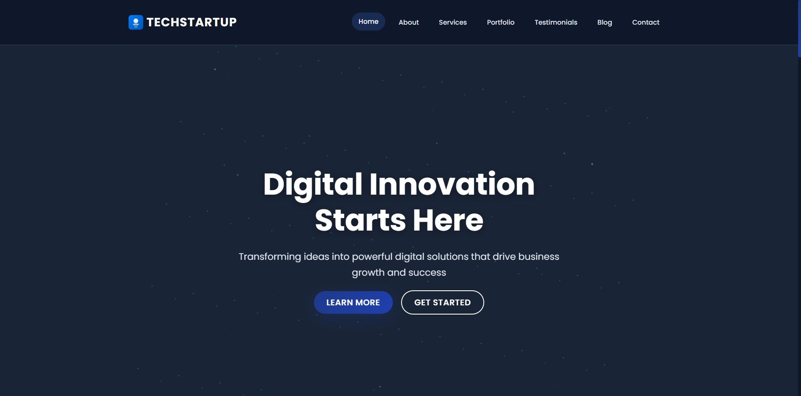
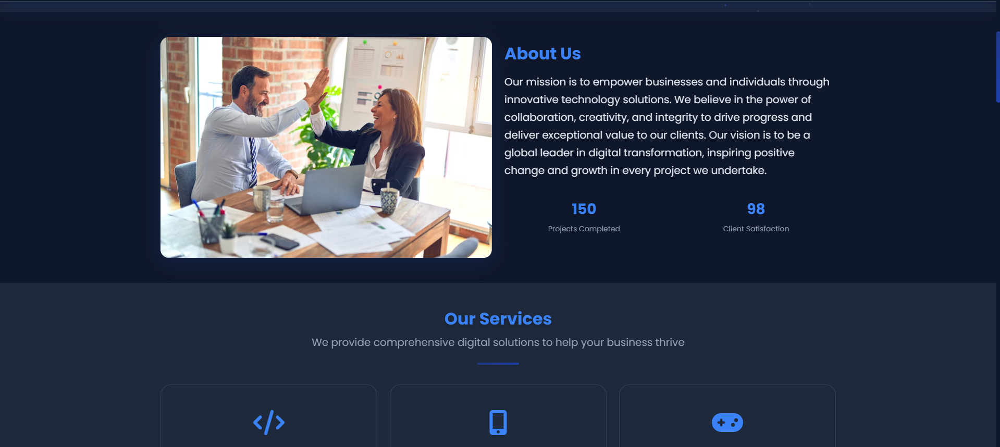
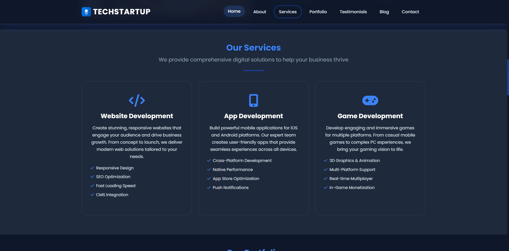
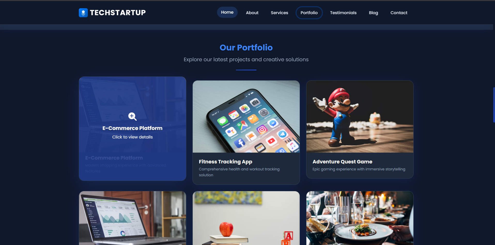
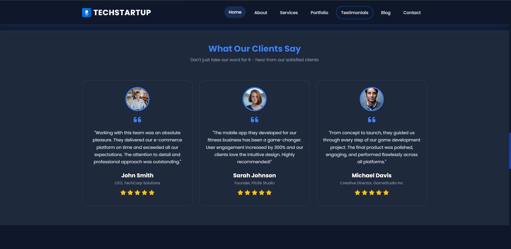
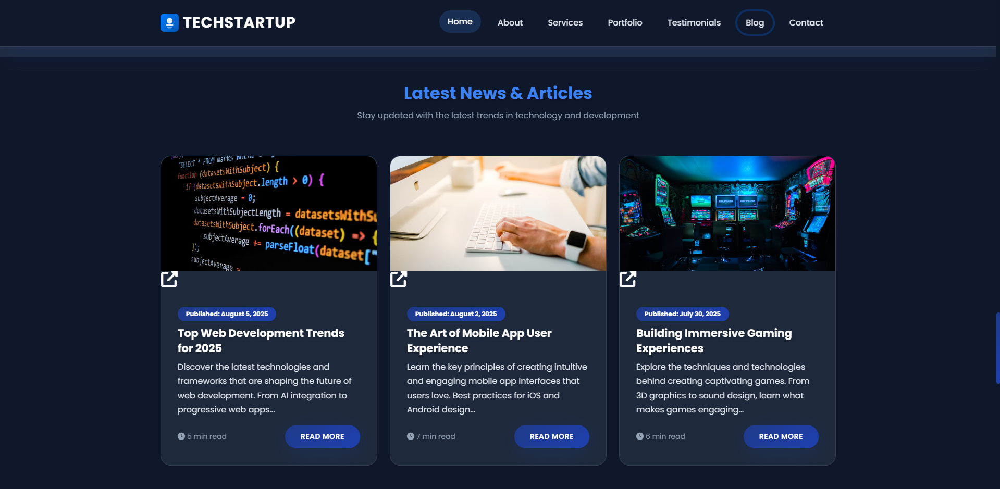
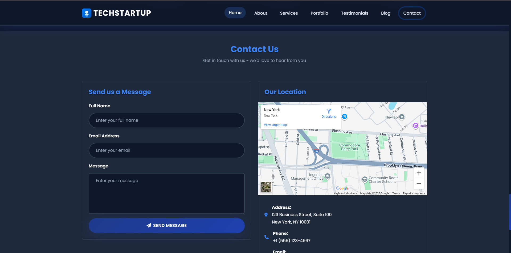

# TechStartup - Digital Innovation Solutions

A modern, responsive, and animated website template for tech startups, built with Bootstrap 5, Font Awesome, and custom CSS/JS.

## Features
- Fully responsive layout
- Animated hero, services, portfolio, testimonials, and blog sections
- Modern SVG logo and favicon
- Interactive footer and smooth scroll navigation
- Portfolio and blog cards with hover effects

## Preview









## Getting Started
1. Clone or download this repository.
2. Open `index.html` in your browser.
3. Customize content, images, and styles as needed.

## Technologies Used
- Bootstrap 5
- Font Awesome 6
- Animate On Scroll (AOS)
- Custom CSS & JavaScript

## Folder Structure
```
bootstrap-project/
├── index.html
├── style.css
├── script.js
├── preview-hero.png
├── preview-portfolio.png
├── preview-footer.png
```

## Customization
- Update the SVG logo in the footer and blog hover as needed.
- Change images by editing the `img` tags in `index.html`.
- Adjust colors and animations in `style.css`.

## License
MIT
